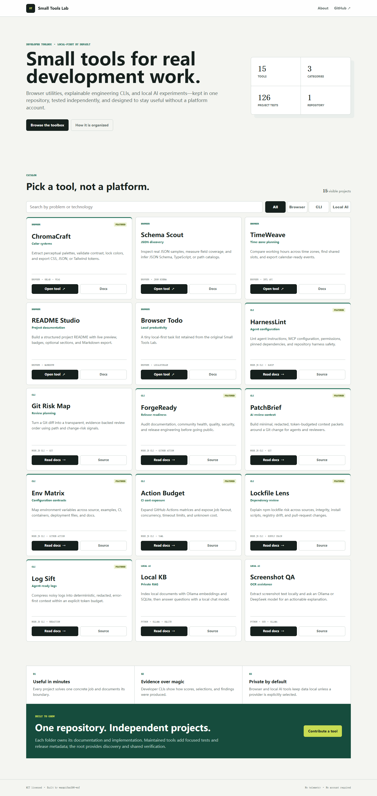

# Developer Toolbox · Small Tools Lab

A practical monorepo of browser utilities, explainable developer CLIs, and local AI experiments. Each project stays independently documented, with focused tests where behavior is reusable; the root provides one catalog, one clone, and one verification path.

[](https://github.com/wangzifan396-wzf/small-tools-lab/actions/workflows/ci.yml)
[](https://wangzifan396-wzf.github.io/small-tools-lab/)
[](LICENSE)

**[Open the toolbox →](https://wangzifan396-wzf.github.io/small-tools-lab/)**



## Why one repository

These projects share an engineering style, not one runtime. Browser tools should open immediately, developer CLIs should explain every decision, and local AI experiments should keep private data on the machine by default. A monorepo concentrates discovery and Stars while preserving a clear boundary inside every project folder.

- 113 focused tools across three categories (89 browser, 22 CLI, 2 local-AI)
- 70 Node.js projects and 2 Python local-AI experiments with 977 focused project-level tests
- Two Python local AI experiments with standard-library unit tests
- Zero-account browser tools and no telemetry
- Root catalog, cross-project verification, CI, and GitHub Pages
- Per-project README, screenshots, security guidance, and release metadata where relevant

## Catalog

### Browser tools (89)

| Project | Purpose | Open |
| --- | --- | --- |
| [ChromaCraft](projects/chromacraft/README.md) | Perceptual palette extraction, WCAG contrast, and design-token export | [Launch](https://wangzifan396-wzf.github.io/small-tools-lab/projects/chromacraft/) |
| [Schema Scout](projects/schema-scout/README.md) | Infer JSON Schema, TypeScript, and field coverage from real samples | [Launch](https://wangzifan396-wzf.github.io/small-tools-lab/projects/schema-scout/) |
| [TimeWeave](projects/timeweave/README.md) | Find shared working hours across time zones and export events | [Launch](https://wangzifan396-wzf.github.io/small-tools-lab/projects/timeweave/) |
| [README Studio](projects/readme-studio/README.md) | Compose structured project documentation with live preview | [Launch](https://wangzifan396-wzf.github.io/small-tools-lab/projects/readme-studio/) |
| [Browser Todo](projects/browser-todo/README.md) | Tiny localStorage task list retained from the original lab | [Launch](https://wangzifan396-wzf.github.io/small-tools-lab/projects/browser-todo/) |
| [Leafnote](projects/leafnote/README.md) | Local-first Markdown notes & knowledge base with wiki-links, backlinks, tags, and search | [Launch](https://wangzifan396-wzf.github.io/small-tools-lab/projects/leafnote/) |
| [Sketchly](projects/sketchly/README.md) | Local-first infinite-canvas whiteboard with a hand-drawn renderer and PNG/JSON export | [Launch](https://wangzifan396-wzf.github.io/small-tools-lab/projects/sketchly/) |
| [Regex Visualizer](projects/regex-visualizer/README.md) | Explain a regular expression token by token and render an HTML-safe highlight | [Launch](https://wangzifan396-wzf.github.io/small-tools-lab/projects/regex-visualizer/) |
| [Password Strength](projects/password-strength/README.md) | Estimate password strength from character-class entropy with an offline crack-time estimate | [Launch](https://wangzifan396-wzf.github.io/small-tools-lab/projects/password-strength/) |
| [Cron Describe](projects/cron-describe/README.md) | Turn a cron expression into plain Chinese and list the next run times | [Launch](https://wangzifan396-wzf.github.io/small-tools-lab/projects/cron-describe/) |
| [CtxCalc](projects/ctxcalc/README.md) | Estimate prompt tokens and check fit against a model context window | [Launch](https://wangzifan396-wzf.github.io/small-tools-lab/projects/ctxcalc/) |
| [JwtPeek](projects/jwtpeek/README.md) | Decode a JWT and surface expiry / issued / not-before timing | [Launch](https://wangzifan396-wzf.github.io/small-tools-lab/projects/jwtpeek/) |
| [Radix](projects/radix/README.md) | Convert between bases 2–36 with BigInt-exact math and a bit & byte view | [Launch](https://wangzifan396-wzf.github.io/small-tools-lab/projects/radix/) |
| [Epoch](projects/epoch/README.md) | Convert Unix seconds or milliseconds to local, UTC, ISO, and relative time | [Launch](https://wangzifan396-wzf.github.io/small-tools-lab/projects/epoch/) |
| [Word Count](projects/wordcount/README.md) | Count Unicode characters, mixed CJK / Latin text, structure, and reading time | [Launch](https://wangzifan396-wzf.github.io/small-tools-lab/projects/wordcount/) |
| [CSV ⇄ JSON](projects/csvjson/README.md) | Strict quoted-field CSV parser and loss-aware JSON converter | [Launch](https://wangzifan396-wzf.github.io/small-tools-lab/projects/csvjson/) |
| [UUID Gen](projects/uuidgen/README.md) | Generate RFC 4122 v4 identifiers using cryptographically secure randomness | [Launch](https://wangzifan396-wzf.github.io/small-tools-lab/projects/uuidgen/) |
| [Base64](projects/base64/README.md) | Encode and decode UTF-8 text safely, including CJK and emoji | [Launch](https://wangzifan396-wzf.github.io/small-tools-lab/projects/base64/) |
| [SQL 格式化 / 压缩](projects/sqlfmt/README.md) | Keyword-upper, clause-line-break, AND/OR indent; string & comment safe | [Launch](https://wangzifan396-wzf.github.io/small-tools-lab/projects/sqlfmt/) |
| [curl 转代码](projects/curlcon/README.md) | Convert a curl command to JS fetch and Python requests | [Launch](https://wangzifan396-wzf.github.io/small-tools-lab/projects/curlcon/) |
| [CSS 美化 / 压缩](projects/cssfmt/README.md) | Brace-aware CSS beautify and minify, strings/comments preserved | [Launch](https://wangzifan396-wzf.github.io/small-tools-lab/projects/cssfmt/) |
| [HTML 美化 / 压缩](projects/htmlfmt/README.md) | Tag-aware HTML beautify and minify, script/style & attr strings preserved | [Launch](https://wangzifan396-wzf.github.io/small-tools-lab/projects/htmlfmt/) |
| [XML 美化 / 压缩](projects/xmlfmt/README.md) | Element-aware XML beautify and minify, CDATA/comments/PIs preserved | [Launch](https://wangzifan396-wzf.github.io/small-tools-lab/projects/xmlfmt/) |
| [TOTP 动态口令](projects/totp/README.md) | RFC 6238 TOTP generator, SHA-1/256/512, Base32/Hex/text secrets, countdown & otpauth URI | [Launch](https://wangzifan396-wzf.github.io/small-tools-lab/projects/totp/) |
| [User-Agent 解析](projects/uaparse/README.md) | Parse UA into browser, engine (Blink/Gecko/WebKit), OS and device type/vendor/model | [Launch](https://wangzifan396-wzf.github.io/small-tools-lab/projects/uaparse/) |
| [哈希类型识别](projects/hashid/README.md) | Identify hash algorithm by prefix/length/charset: bcrypt, Argon2, MD5, SHA families | [Launch](https://wangzifan396-wzf.github.io/small-tools-lab/projects/hashid/) |
| [MAC 地址工具](projects/macaddr/README.md) | Normalize/reformat MAC, random generate, OUI vendor lookup, unicast/multicast & local/global bits | [Launch](https://wangzifan396-wzf.github.io/small-tools-lab/projects/macaddr/) |
| [NATO 音标字母](projects/nato/README.md) | Text ↔ NATO/ICAO phonetic alphabet, full 26-letter + 10-digit chart | [Launch](https://wangzifan396-wzf.github.io/small-tools-lab/projects/nato/) |
| [RSA 加解密](projects/rsa/README.md) | Pure-JS RSA keygen + encrypt/decrypt, PKCS#1 v1.5, interoperable with OpenSSL/Node | [Launch](https://wangzifan396-wzf.github.io/small-tools-lab/projects/rsa/) |
| [数学表达式计算器](projects/mathcalc/README.md) | Safe recursive-descent expression evaluator: +−×÷%^, functions & constants, no eval | [Launch](https://wangzifan396-wzf.github.io/small-tools-lab/projects/mathcalc/) |
| [WiFi 二维码生成器](projects/wifiqr/README.md) | Generate scannable WiFi config QR codes (WPA/WEP/open, hidden SSID) | [Launch](https://wangzifan396-wzf.github.io/small-tools-lab/projects/wifiqr/) |
| [TOML ⇄ JSON 转换器](projects/toml/README.md) | Zero-dependency TOML ⇄ JSON: strings/ints/floats/dates/arrays/inline-tables/tables | [Launch](https://wangzifan396-wzf.github.io/small-tools-lab/projects/toml/) |
| [MIME 类型查询](projects/mime/README.md) | Look up MIME type by extension (or the reverse), with charset hints | [Launch](https://wangzifan396-wzf.github.io/small-tools-lab/projects/mime/) |
| [CIDR 子网计算](projects/cidr/README.md) | IPv4 subnet calculator: network/broadcast, mask, host range & count | [Launch](https://wangzifan396-wzf.github.io/small-tools-lab/projects/cidr/) |
| [ULID 生成 / 解析](projects/ulid/README.md) | Generate / decode sortable 26-char ULIDs (Crockford Base32) | [Launch](https://wangzifan396-wzf.github.io/small-tools-lab/projects/ulid/) |
| [Base58](projects/base58/README.md) | Bitcoin-style Base58 codec (no 0/O/I/l), handy for wallet addresses and short IDs | [Launch](https://wangzifan396-wzf.github.io/small-tools-lab/projects/base58/) |
| [Base32](projects/base32/README.md) | RFC 4648 and Crockford Base32 codec, 5-bit grouping with case tolerance | [Launch](https://wangzifan396-wzf.github.io/small-tools-lab/projects/base32/) |
| [Base85](projects/base85/README.md) | Ascii85 and Z85 Base85 codec, packing 4 bytes into 5 characters | [Launch](https://wangzifan396-wzf.github.io/small-tools-lab/projects/base85/) |
| [CRC](projects/crc/README.md) | CRC-16/CCITT-FALSE, XMODEM, IBM-ARC, MODBUS, and CRC-32 checksum calculator | [Launch](https://wangzifan396-wzf.github.io/small-tools-lab/projects/crc/) |
| [Punycode](projects/punycode/README.md) | RFC 3492 Punycode codec for Chinese / emoji domain toASCII / toUnicode | [Launch](https://wangzifan396-wzf.github.io/small-tools-lab/projects/punycode/) |
| [QR Code](projects/qrcode/README.md) | Generate scalable SVG QR codes with selectable error correction and quiet zone | [Launch](https://wangzifan396-wzf.github.io/small-tools-lab/projects/qrcode/) |
| [Barcode](projects/barcode/README.md) | Generate Code 128 (Code B) barcodes as SVG with checksum and quiet zone | [Launch](https://wangzifan396-wzf.github.io/small-tools-lab/projects/barcode/) |
| [JSON Format](projects/jsonfmt/README.md) | Format, minify, and validate JSON with clear local errors | [Launch](https://wangzifan396-wzf.github.io/small-tools-lab/projects/jsonfmt/) |
| [Color Convert](projects/colorconv/README.md) | Convert HEX, RGB, and HSL colors with a live preview | [Launch](https://wangzifan396-wzf.github.io/small-tools-lab/projects/colorconv/) |
| [Morse](projects/morse/README.md) | Translate text and Morse code in both directions | [Launch](https://wangzifan396-wzf.github.io/small-tools-lab/projects/morse/) |
| [RomanNum](projects/roman/README.md) | Convert Arabic and Roman numerals (1–3999) both ways | [Launch](https://wangzifan396-wzf.github.io/small-tools-lab/projects/roman/) |
| [DiceBox](projects/dice/README.md) | Cryptographically secure dice, random integers, and no-repeat draws | [Launch](https://wangzifan396-wzf.github.io/small-tools-lab/projects/dice/) |
| [DateDiff](projects/datediff/README.md) | Compute the year/month/day gap between two dates and age | [Launch](https://wangzifan396-wzf.github.io/small-tools-lab/projects/datediff/) |
| [RegexTester](projects/regex/README.md) | Live regex matching with capture-group highlighting | [Launch](https://wangzifan396-wzf.github.io/small-tools-lab/projects/regex/) |
| [NumBase](projects/num-base/README.md) | Convert numbers between bases 2–36 (binary/octal/decimal/hex) | [Launch](https://wangzifan396-wzf.github.io/small-tools-lab/projects/num-base/) |
| [PassGen](projects/password-generator/README.md) | Cryptographically secure password generator with entropy estimate | [Launch](https://wangzifan396-wzf.github.io/small-tools-lab/projects/password-generator/) |
| [Timer](projects/timer/README.md) | Countdown and stopwatch with lap timing | [Launch](https://wangzifan396-wzf.github.io/small-tools-lab/projects/timer/) |
| [TextDiff](projects/text-diff/README.md) | Line-by-line text diff (LCS) highlighting additions/deletions | [Launch](https://wangzifan396-wzf.github.io/small-tools-lab/projects/text-diff/) |
| [BMI](projects/bmi/README.md) | BMI calculator with China/WHO standards and healthy-weight range | [Launch](https://wangzifan396-wzf.github.io/small-tools-lab/projects/bmi/) |
| [URLEncode](projects/url-encode/README.md) | Percent-encode / decode text, with form-style space-to-plus | [Launch](https://wangzifan396-wzf.github.io/small-tools-lab/projects/url-encode/) |
| [HTMLEntity](projects/html-entity/README.md) | Encode / decode HTML entities (named, decimal, hex) | [Launch](https://wangzifan396-wzf.github.io/small-tools-lab/projects/html-entity/) |
| [LoremGen](projects/lorem/README.md) | Generate Lorem Ipsum by paragraph / sentence / word | [Launch](https://wangzifan396-wzf.github.io/small-tools-lab/projects/lorem/) |
| [Contrast](projects/contrast/README.md) | WCAG 2.1 contrast checker with AA / AAA badges | [Launch](https://wangzifan396-wzf.github.io/small-tools-lab/projects/contrast/) |
| [JSONDiff](projects/json-diff/README.md) | Structural diff of two JSON objects by path | [Launch](https://wangzifan396-wzf.github.io/small-tools-lab/projects/json-diff/) |
| [UnicodeView](projects/unicode/README.md) | Inspect per-character Unicode codepoints and UTF-8 / UTF-16 | [Launch](https://wangzifan396-wzf.github.io/small-tools-lab/projects/unicode/) |
| [HashLab](projects/hash/README.md) | MD5 / SHA digest and HMAC for text and files with Web Crypto | [Launch](https://wangzifan396-wzf.github.io/small-tools-lab/projects/hash/) |
| [Base64Image](projects/base64-image/README.md) | Convert images to and from Base64 Data URLs, with preview and download | [Launch](https://wangzifan396-wzf.github.io/small-tools-lab/projects/base64-image/) |
| [GradientLab](projects/gradient/README.md) | Build linear / radial CSS gradients with editable color stops | [Launch](https://wangzifan396-wzf.github.io/small-tools-lab/projects/gradient/) |
| [SemverCheck](projects/semver/README.md) | Validate, sort, and range-match semantic versions | [Launch](https://wangzifan396-wzf.github.io/small-tools-lab/projects/semver/) |
| [CronMaker](projects/cron-maker/README.md) | Visually build 5-field cron expressions with a Chinese description | [Launch](https://wangzifan396-wzf.github.io/small-tools-lab/projects/cron-maker/) |
| [PaletteLab](projects/color-palette/README.md) | Generate complementary / analogous / triadic palettes from a base color | [Launch](https://wangzifan396-wzf.github.io/small-tools-lab/projects/color-palette/) |
| [HTTPCodes](projects/http-codes/README.md) | Look up 1xx–5xx HTTP status codes with live search | [Launch](https://wangzifan396-wzf.github.io/small-tools-lab/projects/http-codes/) |
| [QueryParse](projects/query-parse/README.md) | Parse URL query strings into editable key/value pairs and rebuild | [Launch](https://wangzifan396-wzf.github.io/small-tools-lab/projects/query-parse/) |
| [NanoID](projects/nanoid/README.md) | Secure random ID / token generator with custom alphabet and bulk | [Launch](https://wangzifan396-wzf.github.io/small-tools-lab/projects/nanoid/) |
| [CipherLab](projects/cipher/README.md) | Caesar / ROT13 / Atbash / Vigenère / Base64 classical ciphers | [Launch](https://wangzifan396-wzf.github.io/small-tools-lab/projects/cipher/) |
| [YamlFlow](projects/yaml-json/README.md) | YAML (block subset) ⇄ JSON, nested maps & sequences | [Launch](https://wangzifan396-wzf.github.io/small-tools-lab/projects/yaml-json/) |
| [HTMLPreview](projects/html-preview/README.md) | Live HTML render in isolated iframe, download .html | [Launch](https://wangzifan396-wzf.github.io/small-tools-lab/projects/html-preview/) |
| [ChartForge](projects/chart-maker/README.md) | Bar / line / pie charts as downloadable SVG | [Launch](https://wangzifan396-wzf.github.io/small-tools-lab/projects/chart-maker/) |
| [MockGen](projects/mock-data/README.md) | Fake person data (zh/en), export JSON / CSV | [Launch](https://wangzifan396-wzf.github.io/small-tools-lab/projects/mock-data/) |
| [IniFlow](projects/ini-json/README.md) | INI config ⇄ JSON, sections & type inference | [Launch](https://wangzifan396-wzf.github.io/small-tools-lab/projects/ini-json/) |
| [LoremGen](projects/lorem-ipsum/README.md) | Lorem Ipsum / 中文 placeholder generator | [Launch](https://wangzifan396-wzf.github.io/small-tools-lab/projects/lorem-ipsum/) |
| [MDView](projects/markdown-preview/README.md) | Lightweight Markdown preview (escaped + link-checked) | [Launch](https://wangzifan396-wzf.github.io/small-tools-lab/projects/markdown-preview/) |
| [DiffLab](projects/diff-text/README.md) | Line-level LCS diff with inline char highlighting | [Launch](https://wangzifan396-wzf.github.io/small-tools-lab/projects/diff-text/) |
| [Passphrase](projects/passphrase/README.md) | Diceware passphrase generator with live entropy estimate | [Launch](https://wangzifan396-wzf.github.io/small-tools-lab/projects/passphrase/) |
| [SvgFmt](projects/svgfmt/README.md) | SVG minify (strip comments/whitespace) and pretty-print | [Launch](https://wangzifan396-wzf.github.io/small-tools-lab/projects/svgfmt/) |
| [NumWords](projects/numwords/README.md) | Spell integers as English words (negative & UK "and" supported) | [Launch](https://wangzifan396-wzf.github.io/small-tools-lab/projects/numwords/) |
| [JSONPath Explorer](projects/jsonpath/README.md) | Query JSON properties, indexes, wildcards, and recursive paths without eval | [Launch](https://wangzifan396-wzf.github.io/small-tools-lab/projects/jsonpath/) |
| [OpenAPI Lab](projects/openapi-lab/README.md) | Validate OpenAPI 3 contracts, browse operations, and generate curl/Fetch/Python requests locally | [Launch](https://wangzifan396-wzf.github.io/small-tools-lab/projects/openapi-lab/) |
| [HAR Viewer](projects/har-viewer/README.md) | Inspect HAR waterfalls and performance findings locally, then export a safer redacted capture | [Launch](https://wangzifan396-wzf.github.io/small-tools-lab/projects/har-viewer/) |
| [SBOM Atlas](projects/sbom-atlas/README.md) | Normalize, diagnose, trace, and compare CycloneDX or SPDX software inventories locally | [Launch](https://wangzifan396-wzf.github.io/small-tools-lab/projects/sbom-atlas/) |
| [SARIF Compass](projects/sarif-compass/README.md) | Triage and compare SARIF 2.1.0 scans locally, then export a privacy-clean report | [Launch](https://wangzifan396-wzf.github.io/small-tools-lab/projects/sarif-compass/) |
| [OCI Image Inspector](projects/oci-image-inspector/README.md) | Sparsely inspect Docker save and OCI image archives without loading or extracting layers | [Launch](https://wangzifan396-wzf.github.io/small-tools-lab/projects/oci-image-inspector/) |
| [Lighthouse Report Lab](projects/lighthouse-report-lab/README.md) | Analyze Lighthouse metrics and budgets locally, then compare performance regressions | [Launch](https://wangzifan396-wzf.github.io/small-tools-lab/projects/lighthouse-report-lab/) |
| [CSP Studio](projects/csp-studio/README.md) | Audit CSP3 directives, simulate resource URLs, and generate a hardened local policy | [Launch](https://wangzifan396-wzf.github.io/small-tools-lab/projects/csp-studio/) |

### Developer CLIs (22)

| Project | Purpose |
| --- | --- |
| [HarnessLint](projects/harnesslint/README.md) | Audit agent instructions, MCP configuration, permissions, and supply-chain risks |
| [Git Risk Map](projects/git-risk-map/README.md) | Rank changed files for review using transparent Git risk signals |
| [ForgeReady](projects/forge-ready/README.md) | Measure open-source release readiness across five bounded categories |
| [PatchBrief](projects/patchbrief/README.md) | Build minimal, redacted, token-budgeted context around a Git diff |
| [Env Matrix](projects/env-matrix/README.md) | Map environment-variable contracts across source, examples, CI, containers, and docs |
| [Action Budget](projects/action-budget/README.md) | Expose GitHub Actions matrix fanout, concurrency, and timeout exposure |
| [Lockfile Lens](projects/lockfile-lens/README.md) | Explain npm lockfile risk across sources, integrity, install scripts, registries, and diffs |
| [Log Sift](projects/log-sift/README.md) | Compact noisy logs into deterministic, redacted, error-first context for humans and agents |
| [Subzen](projects/subzen/README.md) | Zero-dependency subtitle parser, quality linter, and auto-fixer with first-class CJK typography |
| [Diffwords](projects/diffwords/README.md) | Word-level, CJK-aware text differ rendering inline, unified, HTML, and JSON |
| [Cronly](projects/cronly/README.md) | Parse, validate, and describe cron expressions; compute next/previous runs with timezones |
| [Quanty](projects/quanty/README.md) | Zero-dependency number and byte formatting: bytes, grouped numbers, compact, ordinals |
| [Hashforge](projects/hashforge/README.md) | Zero-dependency hashing, HMAC and codec (SHA-1/256/384/512, HMAC, base64/hex) on Web Crypto |
| [Jsonq](projects/jsonq/README.md) | Zero-dependency JSON query & transform: get by path, pick/omit, filter, sort |
| [Unit Convert](projects/unit-convert/README.md) | Zero-dependency unit converter: length, mass, temperature, speed, data (decimal + binary), time, area, volume, energy, pressure |
| [Ignore Doctor](projects/ignore-doctor/README.md) | Audit ignore boundaries for leaks, dangerous negations, duplicate rules, and Docker context bloat |
| [Port Matrix](projects/port-matrix/README.md) | Map port contracts across source, environment files, containers, orchestration, and docs |
| [Text Forge](projects/text-forge/README.md) | Zero-dependency text toolkit: slugify, case conversion, Unicode normalization, diacritic removal, full/half-width conversion, and whitespace cleaning |
| [Agent Trace](projects/agent-trace/README.md) | Analyze local coding-agent JSONL for token use, tool latency, repeated reads, and failure loops without prompt bodies |
| [Skill Sentry](projects/skill-sentry/README.md) | Statically scan AI agent skills for injection, exfiltration, destructive behavior, unsafe references, and supply-chain risk |
| [Port Origin](projects/port-origin/README.md) | Trace a port or PID to its command, runtime hints, and bounded parent-process ancestry across major operating systems |
| [MCP Probe](projects/mcp-probe/README.md) | Read-only MCP stdio initialization, capability inventory, latency measurement, and risky metadata checks |

### Local AI

| Project | Purpose |
| --- | --- |
| [Local KB](projects/local-kb/README.md) | Local document RAG using Ollama embeddings and SQLite |
| [Screenshot QA](projects/screenshot-qa/README.md) | Local OCR followed by Ollama or optional DeepSeek analysis |

## Verify the toolbox

Node.js 20 or newer is required for root and Node project checks. Python 3.10 or newer is enough for the included Python unit tests; runtime OCR dependencies are not needed by those tests.

```sh
git clone https://github.com/wangzifan396-wzf/small-tools-lab.git
cd small-tools-lab
npm install
npm run verify
npm run test:python
```

Run one project directly instead:

```sh
cd projects/action-budget
npm test
node bin/action-budget.js ../../
```

Every project owns its detailed usage instructions. The root package is private and exists only for workspace dependency installation and shared validation; it is not published to npm.

## Repository structure

```text
small-tools-lab/
├── index.html              # Filterable GitHub Pages catalog
├── projects/
│   ├── action-budget/      # Independent tool folders
│   ├── chromacraft/
│   └── ...
├── scripts/                # Cross-project verification
├── tests/                  # Root catalog tests
├── notes/                  # Historical automation notes
└── .github/workflows/      # CI and Pages deployment
```

## 中文说明

这是一个统一的开发者工具箱仓库。浏览器工具、Node.js CLI 和本地 AI 实验都放在 `projects/` 下，每个项目仍保留独立 README、测试和开源边界。以后新增工具继续添加新文件夹，不再为每个小工具创建一个 GitHub 仓库。

根目录负责工具导航、统一测试和 GitHub Pages 展示；项目目录负责具体实现。这样所有关注度集中在一个仓库，同时不会把不同工具的代码混在同一模块里。

See [CONTRIBUTING.md](CONTRIBUTING.md) before adding a project and [SECURITY.md](SECURITY.md) for private vulnerability reports.

## License

[MIT](LICENSE). Individual project folders may repeat the MIT text so they remain independently distributable.
