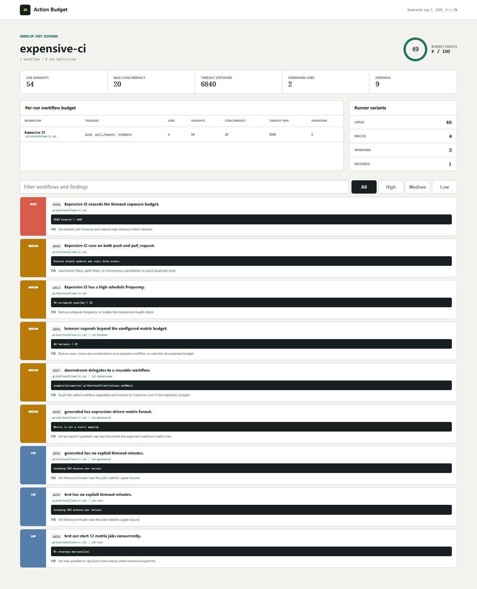

# Action Budget

See GitHub Actions fanout before the bill, queue, or timeout surprises. Action Budget statically expands workflow matrices and exposes per-run job count, burst concurrency, timeout-minutes, schedule frequency, and unknown downstream cost.

[](https://github.com/wangzifan396-wzf/small-tools-lab/actions/workflows/ci.yml)
[](https://www.npmjs.com/package/action-budget)
[](LICENSE)

A two-axis matrix is easy to read. Several matrices, exclusions, special includes, schedules, reusable workflows, and missing timeouts are not. Action Budget turns the visible workflow definition into a reviewable budget without running a workflow or calling the GitHub API.

- YAML-aware parsing of every `.github/workflows/*.yml` file
- Cartesian matrix expansion with static `include` and `exclude` semantics
- Per-workflow visible variants, maximum burst concurrency, and timeout exposure
- Runner breakdown for Linux, Windows, macOS, self-hosted, reusable, and dynamic labels
- Detection of expression-driven matrices and reusable workflows as unknown cost
- Common cron frequency estimation, duplicate push/PR exposure, and configurable gates
- Pretty terminal, JSON, Markdown, and filterable self-contained HTML reports
- GitHub Action and CLI overrides for CI budget enforcement



## Quick start

Run without installing:

```sh
npx action-budget@latest .
```

Set an explicit CI budget:

```sh
action-budget . --max-jobs 40 --max-minutes 1200 --fail-on medium
```

Example output:

```text
Action Budget
========================================================================================
expensive-ci  |  1 workflows  |  4 job definitions
Variants 54  Concurrency 20  Timeout exposure 6840 min  Unknown 2
Health F 49/100  High 1  Medium 5  Low 3
```

Exit code `1` means a finding met `--fail-on`, `2` means usage or configuration failed, and `0` means the gate passed.

## Metrics, not pretend billing

| Metric | Meaning |
| --- | --- |
| Visible variants | Statically enumerable job instances; dynamic matrices count as one visible placeholder and remain marked unknown |
| Max concurrency | Sum of visible per-job variants after `max-parallel`; an upper bound that does not model `needs`, runner availability, or account quotas |
| Timeout exposure | Variants multiplied by `timeout-minutes`; omitted timeouts use the configured assumption |
| Scheduled runs/day | Runs on an active day for common static minute/hour cron fields |
| Unknown jobs | Expression matrices and reusable workflow calls whose full fanout is not present in the file |

Timeout exposure is a worst-case limit, not predicted runtime. Action Budget intentionally does not convert minutes into money: hosted-runner prices, included quotas, public-repository treatment, larger runners, and enterprise contracts vary. Use the stable structural metrics here, then apply your own billing model downstream to JSON output.

## Rules

| Rule | Severity | Finding |
| --- | --- | --- |
| `AB001` | high | Static matrix exceeds GitHub's 256-job matrix limit |
| `AB002` | medium | Matrix exceeds the configured variant budget |
| `AB003` | high | Workflow exceeds the configured per-run job budget |
| `AB004` | high | Workflow exceeds the configured timeout exposure budget |
| `AB005` | low | Job has no explicit `timeout-minutes` |
| `AB006` | medium | Dynamic matrix fanout is unknown |
| `AB007` | medium | Reusable workflow hides downstream fanout |
| `AB008` | low | Large matrix has no `max-parallel` cap |
| `AB009` | medium | Push and pull request triggers may duplicate work |
| `AB010` | medium | Static schedule exceeds the daily-run budget |
| `AB011` | medium | Timeout or parallel limit is invalid or dynamic |
| `AB012` | high | Workflow YAML cannot be parsed safely |

## Reports

```sh
action-budget . --format pretty
action-budget . --format json --output action-budget.json
action-budget . --format markdown --output action-budget.md
action-budget . --format html --output action-budget-report.html --fail-on none
```

The HTML report needs no server and includes workflow search plus severity filters. JSON preserves per-job axes, visible fanout, timeout assumption, concurrency, and runner breakdown for custom automation.

## Configuration

Add `.action-budget.json` at the repository root:

```json
{
  "ignore": [".github/workflows/legacy-*.yml"],
  "defaultTimeoutMinutes": 360,
  "maxMatrixVariants": 20,
  "maxJobsPerRun": 64,
  "maxTimeoutMinutesPerRun": 1440,
  "maxScheduledRunsPerDay": 24,
  "concurrencyWarning": 8
}
```

Patterns are repository-relative and support `*` within a segment and `**` across segments. CLI `--max-jobs`, `--max-minutes`, `--max-matrix`, and `--default-timeout` values override the file.

## GitHub Actions

```yaml
permissions:
  contents: read

steps:
  - uses: actions/checkout@v7
  - uses: wangzifan396-wzf/small-tools-lab/projects/action-budget@main
    with:
      fail-on: high
      max-jobs: 64
      max-minutes: 1440
```

The action writes Markdown to `action-budget.md`, appends it to the job summary, and exposes the path as `steps.<id>.outputs.report`. It installs the locked production YAML parser inside the action directory before scanning.

## Static boundaries

Action Budget parses workflow YAML as data and never evaluates expressions, executes steps, or contacts GitHub. It cannot know the contents of a called reusable workflow, runtime-generated matrices, event frequency for push and pull requests, early job cancellation, cache hit rates, actual durations, or account-level concurrency. Those uncertainties remain visible instead of being silently guessed.

Matrix expansion follows the static job matrix model documented in [GitHub's matrix guide](https://docs.github.com/en/actions/using-jobs/using-a-matrix-for-your-jobs). Cron frequency is estimated only when the minute and hour fields use `*`, `*/step`, or numeric lists; more complex schedules remain unestimated.

See [CONTRIBUTING.md](CONTRIBUTING.md) for analyzer proposals, [SECURITY.md](SECURITY.md) for private reports, and [CHANGELOG.md](CHANGELOG.md) for user-facing changes.

## License

[MIT](LICENSE)
