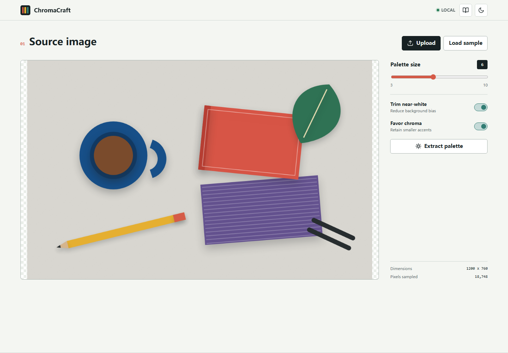
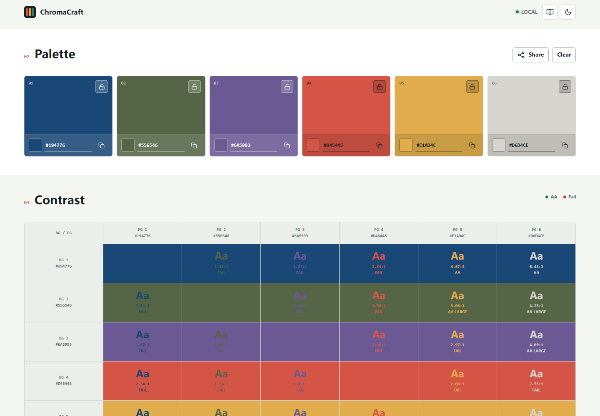
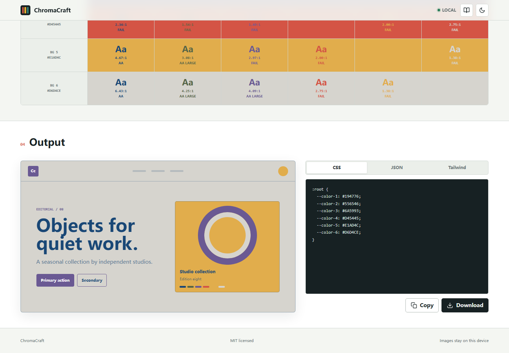

# ChromaCraft

ChromaCraft is a local-first image palette workbench. It extracts perceptual color clusters, evaluates WCAG contrast, previews the palette in a practical interface, and exports design tokens without uploading the source image.



## Features

- Image upload, drag and drop, clipboard paste, and a built-in sample scene
- Deterministic k-means clustering in OKLab color space
- Adjustable palettes from 3 to 10 colors
- Near-white trimming and chroma-aware accent retention
- Editable and lockable swatches that survive re-extraction
- Full foreground/background WCAG contrast matrix
- Live interface preview with automatic readable foreground colors
- CSS custom property, JSON, and Tailwind config export
- Shareable palette URLs and local session restoration
- Light and dark themes, responsive layout, and keyboard support
- No runtime dependencies, build step, analytics, accounts, or image uploads

## Interface

| Palette and contrast | Preview and export |
| --- | --- |
|  |  |

The workspace is also verified at a 390 px mobile viewport: [mobile screenshot](docs/chromacraft-mobile.png).

## Run locally

Open `index.html` directly in a modern browser, or run the included static server:

```bash
npm start
```

Then open <http://127.0.0.1:4173>.

## Test

The algorithm test suite uses Node's built-in test runner and has no package dependencies:

```bash
npm test
npm run check
npm run test:browser
```

Node.js 20 or newer is recommended. The browser smoke test uses an installed Chrome, Edge, or Chromium browser; set `CHROME_PATH` when it is not in a standard location.

## How it works

The browser downsamples the rendered source to a bounded working set. Pixels with low alpha are removed, and optionally neutral near-white pixels are skipped. Samples are converted from sRGB to OKLab, clustered with deterministic farthest-point initialization, and converted back to displayable sRGB values. Locked swatches are fixed centroids during later runs.

Contrast ratios use the WCAG relative luminance formula. The matrix marks normal-text AA at `4.5:1` and large-text AA at `3:1`.

## Privacy

Images are decoded and processed in the browser. ChromaCraft has no network requests in its application code. Preferences and the current palette are stored in `localStorage`; image pixels are not persisted.

## Project structure

```text
chromacraft/
|-- assets/              App icon
|-- scripts/serve.js     Dependency-free development server
|-- src/app.js           Browser interaction and rendering
|-- src/color-utils.js   Color math, clustering, and token output
|-- tests/               Node unit tests
|-- index.html
`-- styles.css
```

## Contributing

Read [CONTRIBUTING.md](CONTRIBUTING.md) before opening a pull request. Security issues should follow [SECURITY.md](SECURITY.md).

## License

ChromaCraft is available under the [MIT License](LICENSE). Interface icons are derived from Lucide; see [THIRD_PARTY_NOTICES.md](THIRD_PARTY_NOTICES.md).
