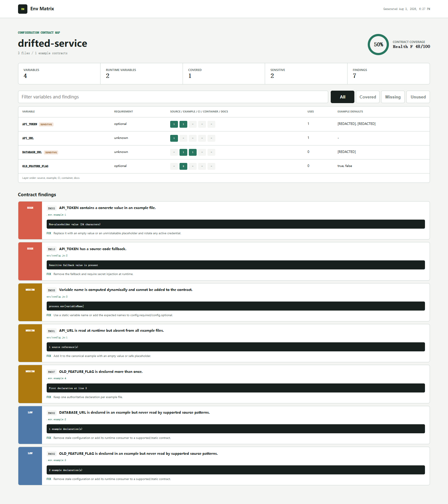

# Env Matrix

See the environment contract your repository actually has. Env Matrix maps variable use across source code, example files, CI, containers, deployment manifests, and documentation.

[](https://github.com/wangzifan396-wzf/small-tools-lab/actions/workflows/ci.yml)
[](https://www.npmjs.com/package/env-matrix)
[](LICENSE)

`.env.example` answers only one part of the configuration question. A variable may be read by the application but missing from the example, documented but unused, injected in CI but absent from deployment, or committed with a concrete secret-like default. Env Matrix joins those layers into one inspectable contract and reports drift with file and line evidence.

- Static discovery for JavaScript, TypeScript, Vite, Deno, Bun, Python, Go, Rust, Java, Ruby, PHP, and C#
- Example file, GitHub Actions, Docker, Compose, Kubernetes, and documentation mapping
- Required, optional, and unknown requirement inference
- 11 deterministic coverage, drift, integrity, deployment, and security rules
- Deep redaction of sensitive default values in every report representation
- Pretty terminal, JSON, Markdown, and filterable self-contained HTML reports
- Severity gates, repository configuration, and a reusable GitHub Action
- Zero runtime dependencies, no source execution, and no network calls



## Quick start

Run it without installing:

```sh
npx env-matrix@latest .
```

Create an HTML report:

```sh
npx env-matrix . --format html --output env-matrix-report.html --fail-on none
```

Typical terminal output:

```text
Env Matrix
====================================================================================
drifted-service  |  3 files  |  1 examples
Coverage 67%  Health F 0/100  High 2  Medium 3  Low 1

VARIABLE                     REQ       SOURCE  EXAMPLE  CI  CONTAINER  DOCS
------------------------------------------------------------------------------------
API_TOKEN                    optional  yes     yes      -   -           -  sensitive
API_URL                      unknown   yes     -        -   -           -
```

Exit code `1` means a finding met `--fail-on`, `2` means usage or configuration failed, and `0` means the gate passed.

## What it catches

| Rule | Severity | Finding |
| --- | --- | --- |
| `EM001` | medium | Runtime variable missing from examples |
| `EM002` | low | Example variable with no supported runtime read |
| `EM003` | high | Concrete sensitive default in an example |
| `EM004` | medium | Conflicting defaults across example files |
| `EM005` | medium | Required variable with an empty example |
| `EM006` | low | Invalid or non-portable declaration |
| `EM007` | medium | Duplicate declaration in one example |
| `EM008` | medium | Dynamic access that cannot be mapped statically |
| `EM009` | high | Runtime `.env` file in the repository publish set |
| `EM010` | high | Sensitive source-code fallback |
| `EM011` | low | Required variable absent from CI and container layers |

## Reports

```sh
env-matrix . --format pretty
env-matrix . --format json --output env-matrix.json
env-matrix . --format markdown --output env-matrix.md
env-matrix . --format html --output env-matrix-report.html
```

The HTML report needs no server. It includes coverage filters and text search. Sensitive-name matching covers common token, password, key, DSN, and database URL forms; their observed defaults are replaced with `[REDACTED]` before a report object is returned.

## Configuration

Add `.env-matrix.json` at the repository root:

```json
{
  "ignore": ["fixtures/**", "generated/**"],
  "exampleFiles": ["config/*.env.template"],
  "required": ["DATABASE_URL"],
  "optional": ["LOG_LEVEL"],
  "ignoreVariables": ["BUILD_TIME_VALUE"],
  "allowUnused": ["FORWARD_COMPAT_FLAG"]
}
```

Patterns are repository-relative, use `/`, and support `*` within one segment and `**` across segments. Configured `required` and `optional` values override inference when the variable is discovered.

## GitHub Actions

```yaml
permissions:
  contents: read

steps:
  - uses: actions/checkout@v7
  - uses: wangzifan396-wzf/small-tools-lab/projects/env-matrix@main
    with:
      fail-on: medium
```

The action writes a Markdown report to `env-matrix.md` and the GitHub job summary. Change `report-output` when another step needs a different path.

## Design boundaries

Env Matrix is a static contract map, not a runtime configuration validator. It recognizes common source and deployment syntax without executing repository code or fully parsing every language. Aliases, framework-specific wrappers, generated configuration, YAML anchors, and dynamically assembled names may need explicit configuration. `EM011` is intentionally low severity because required values can be injected by infrastructure outside the repository.

Secret-name detection is defense in depth, not a credential scanner. If a real secret was committed, remove it from history where appropriate and rotate it even when Env Matrix redacts the report.

See [CONTRIBUTING.md](CONTRIBUTING.md) for parser proposals, [SECURITY.md](SECURITY.md) for private reports, and [CHANGELOG.md](CHANGELOG.md) for user-facing changes.

## License

[MIT](LICENSE)
