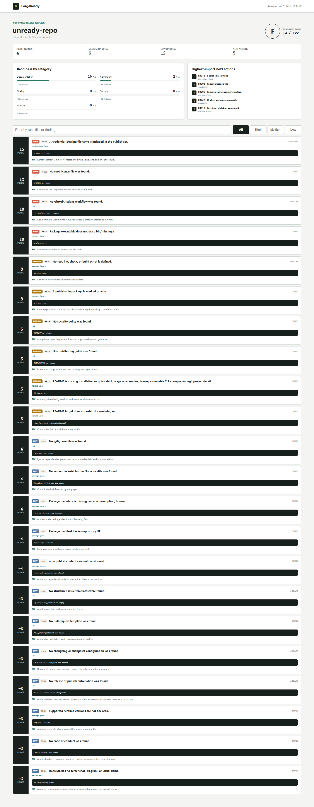

# ForgeReady

Know what is missing before a repository goes public. ForgeReady is an evidence-based release preflight for open-source projects.

[](https://github.com/wangzifan396-wzf/small-tools-lab/actions/workflows/ci.yml)
[](https://www.npmjs.com/package/forge-ready)
[](LICENSE)

Repository launch checklists are easy to skim and easy to forget. ForgeReady inspects the actual publish set, attaches evidence to every finding, scores five bounded categories, and produces a prioritized repair plan that works locally and in CI.

- 29 deterministic checks across documentation, community, quality, security, and release engineering
- CLI, library, app, and general profiles with automatic detection
- Zero runtime dependencies, no source execution, and no network calls
- Pretty terminal, JSON, Markdown, and filterable self-contained HTML reports
- Score gates, rule catalog output, ignores, and per-rule controls
- GitHub Action with job-summary reporting



## Quick start

Run without installing:

```sh
npx forge-ready@latest .
```

Or add a repeatable release gate:

```sh
npm install --save-dev forge-ready
npx forgeready . --profile cli --min-score 80
```

Example output:

```text
ForgeReady
========================================================================
unready-repo  |  cli profile  |  3 files
Grade F  Score 5/100  High 6  Medium 8  Low 5

HIGH   FR016  -15  A credential-bearing filename is included in the publish set.
       credentials.json:1  |  effort immediate
```

Exit code `1` means the score is below `--min-score`, `2` means usage or configuration failed, and `0` means the gate passed.

## What it checks

| Category | Points | Representative evidence |
| --- | ---: | --- |
| Documentation | 25 | README guidance, local links, changelog, visual proof |
| Community | 15 | Contributing guide, conduct, issue forms, pull request template |
| Quality | 25 | CI, validation commands, tests, lockfiles, repository hygiene |
| Security | 20 | Security policy, secret-like content, workflow refs and permissions |
| Release | 15 | License, package metadata, runtime support, publish contents, executable targets |

Category deductions are capped at the category maximum, so one class of problems cannot make the rest of the audit meaningless. Grades are `A >= 90`, `B >= 80`, `C >= 70`, `D >= 55`, and `F < 55`.

List the full rule catalog from the installed version:

```sh
forge-ready --list-rules
```

## Profiles

`auto` selects `cli` for Node packages with `bin`, `library` for packages with entry points, `app` when an `index.html` is present, and `general` otherwise. Select a profile explicitly when repository intent cannot be inferred:

```sh
forge-ready . --profile library
forge-ready . --profile app
```

Profiles currently tune README and publishing expectations. The roadmap includes ecosystem-specific Python, Rust, Go, and container profiles.

## Reports

```sh
forge-ready . --format json --output forge-ready.json
forge-ready . --format markdown --output forge-ready.md
forge-ready . --format html --output forge-ready-report.html
```

Generate the bundled intentionally incomplete repository report:

```sh
npm run demo
```

The HTML report requires no server and includes severity and text filters.

## GitHub Actions

```yaml
permissions:
  contents: read

steps:
  - uses: actions/checkout@v4
  - uses: wangzifan396-wzf/small-tools-lab/projects/forge-ready@main
    with:
      profile: auto
      min-score: 80
```

The action writes the category table, findings, and next actions to the GitHub job summary before applying the score gate.

## Configuration

Add `.forge-ready.json` at the audited repository root:

```json
{
  "profile": "cli",
  "ignore": [
    "examples/**",
    "fixtures/**"
  ],
  "disableRules": [
    "FR006",
    "FR028"
  ]
}
```

Patterns are repository-relative, use `/`, and support `*` inside one segment and `**` across segments. Rules can be disabled when a repository has a documented reason; disabled rules are removed before scoring.

## Design boundaries

ForgeReady measures observable preparation, not project quality or community value. A present security file can still contain bad guidance, a CI workflow can still be ineffective, and release automation is not always appropriate. Every result includes evidence, impact, effort, and a repair suggestion so maintainers retain the final decision.

See [CONTRIBUTING.md](CONTRIBUTING.md) for rule proposals, [SECURITY.md](SECURITY.md) for private reports, and [CHANGELOG.md](CHANGELOG.md) for user-facing changes.

## License

[MIT](LICENSE)
