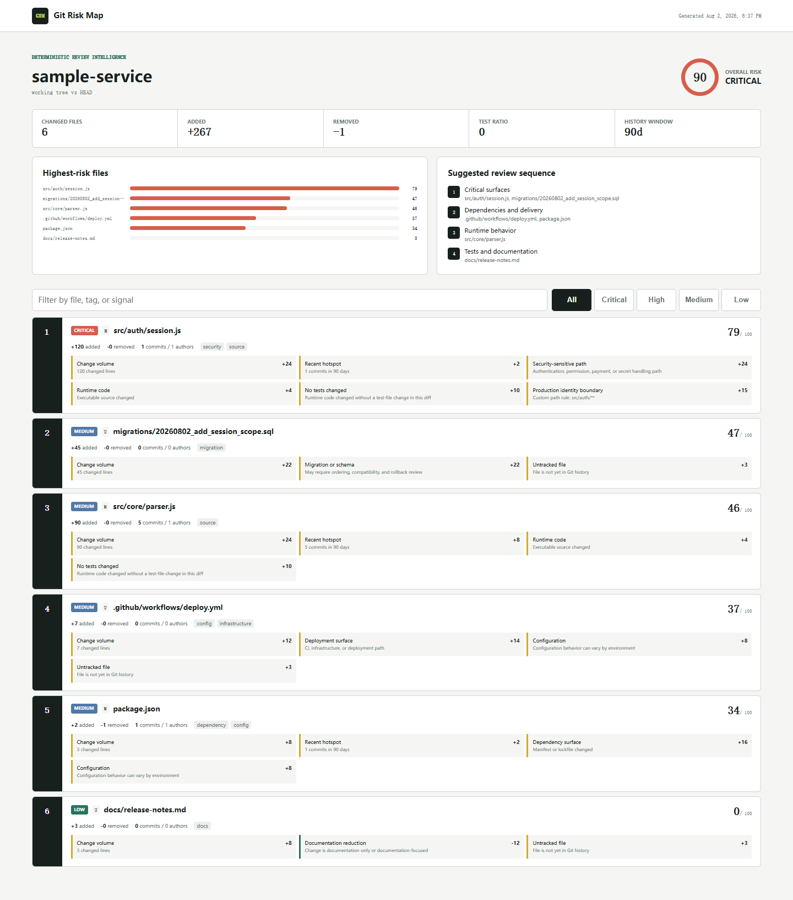

# Git Risk Map

Know where to review first. Git Risk Map turns a Git diff and recent file history into an explainable, prioritized review plan.

[](https://github.com/wangzifan396-wzf/small-tools-lab/actions/workflows/ci.yml)
[](https://www.npmjs.com/package/git-risk-map)
[](LICENSE)

Large diffs are rarely equally risky. A 20-line authorization change can deserve attention before 2,000 generated lines. Git Risk Map combines change volume, recent churn, shared ownership, sensitive paths, migrations, dependencies, delivery configuration, deletions, binaries, and test-file changes into a transparent score for every changed file.

- Zero runtime dependencies and no network calls
- Uses Git metadata, not source execution or an opaque model
- Working tree, staged, and merge-base comparisons
- Pretty terminal, JSON, Markdown, and self-contained HTML output
- Configurable path rules, ignores, thresholds, and history window
- Cross-platform Node.js 20+ and a composable GitHub Action



## Quick start

Run in any Git repository without installing:

```sh
npx git-risk-map@latest .
```

Or install it as a development tool:

```sh
npm install --save-dev git-risk-map
npx riskmap . --staged
```

Typical terminal output:

```text
Git Risk Map
==============================================================================
working tree vs HEAD  |  history 90 days
Risk CRITICAL 90/100  |  6 files  |  +267 -1  |  test ratio 0

 #  RISK       SCORE  CHANGE       FILE
------------------------------------------------------------------------------
 1  CRITICAL    79    +120/-0      src/auth/session.js
             Change volume +24; Security-sensitive path +24; No tests changed +10
```

## Choose a comparison

Analyze all tracked and untracked working-tree changes against `HEAD`:

```sh
git-risk-map .
```

Analyze only the index before committing:

```sh
git-risk-map . --staged
```

Analyze a pull request or branch from its merge base:

```sh
git fetch origin main --depth=200
git-risk-map . --base origin/main --head HEAD
```

The merge-base form uses Git's three-dot comparison, so unrelated updates added to the base branch are not attributed to the change under review.

## How scoring works

Every point is included in the report. The default model considers:

| Signal | Maximum effect | Why it matters |
| --- | ---: | --- |
| Changed lines | +24 | Larger changes are harder to reason about |
| Recent commits | +18 | Hot files carry regression and coordination risk |
| Recent authors | +8 | Shared ownership can signal coordination needs |
| Security-sensitive path | +24 | Auth, permissions, payments, sessions, and secrets need focused review |
| Migration or schema | +22 | Ordering, compatibility, and rollback matter |
| Dependency surface | +16 | Manifest and lockfile changes affect the supply chain |
| Infrastructure or CI | +14 | Delivery changes can have broad blast radius |
| No tests changed | +10 | Runtime behavior changed without a test-file change in the diff |
| Documentation/test/generated path | -8 to -14 | These paths usually reduce direct runtime risk |

File scores are clamped to 0-100. Overall risk starts with the highest file score and adds a logarithmic blast-radius adjustment for the number of changed files. Default levels are `critical >= 75`, `high >= 55`, `medium >= 30`, and `low < 30`.

The `testChangeRatio` is a review proxy: changed test files divided by changed runtime source files. It is not code coverage and is labeled accordingly.

## Reports

```sh
# CI integrations or custom tooling
git-risk-map . --format json --output risk-map.json

# Pull request summary
git-risk-map . --base origin/main --format markdown --output risk-map.md

# Filterable report that opens without a server
git-risk-map . --format html --output git-risk-map-report.html
```

Generate the bundled visual demo from a disposable repository:

```sh
npm run demo
```

The demo repository is deleted immediately after the report is written.

## Risk gates

Use `--fail-on` to turn the overall score into a CI gate:

```sh
git-risk-map . --base origin/main --fail-on critical
```

Supported values are `critical`, `high`, `medium`, `low`, and `none`. Exit code `1` means a non-empty change met the threshold, `2` means usage, configuration, or Git failed, and `0` means the gate passed. An empty comparison always passes.

## GitHub Actions

The action appends a Markdown table and review plan to the job summary. Pull requests automatically use the event's base SHA unless `base` is supplied.

```yaml
permissions:
  contents: read

steps:
  - uses: actions/checkout@v7
    with:
      fetch-depth: 0
  - uses: wangzifan396-wzf/small-tools-lab/projects/git-risk-map@main
    with:
      fail-on: critical
      history-days: 120
```

For a push workflow, pass a base explicitly:

```yaml
  - uses: wangzifan396-wzf/small-tools-lab/projects/git-risk-map@main
    with:
      base: ${{ github.event.before }}
      head: ${{ github.sha }}
```

## Configuration

Add `.git-risk-map.json` at the repository root:

```json
{
  "historyDays": 120,
  "ignore": [
    "dist/**",
    "fixtures/**"
  ],
  "pathRules": [
    {
      "pattern": "src/payments/**",
      "label": "Payment boundary",
      "weight": 20
    },
    {
      "pattern": "examples/**",
      "label": "Example reduction",
      "weight": -10
    }
  ],
  "thresholds": {
    "critical": 80,
    "high": 60,
    "medium": 35,
    "low": 0
  }
}
```

Ignore and path-rule patterns are repository-relative, use `/`, and support `*` inside one path segment and `**` across segments. Custom weights are clamped to -50 through +50.

## Design boundaries

Git Risk Map prioritizes review; it does not prove that code is correct or vulnerable. Path classification is heuristic, a test-file change does not guarantee meaningful tests, and commit frequency is not automatically a defect signal. The report keeps evidence and point contributions visible so teams can tune policy instead of trusting a black box.

The near-term roadmap includes CODEOWNERS-aware routing, coupled-file history, changed-function sizing, machine-readable policy explanations, and reusable rule presets. See [CONTRIBUTING.md](CONTRIBUTING.md) for scoring proposals and [SECURITY.md](SECURITY.md) for private reports.

## License

[MIT](LICENSE)
