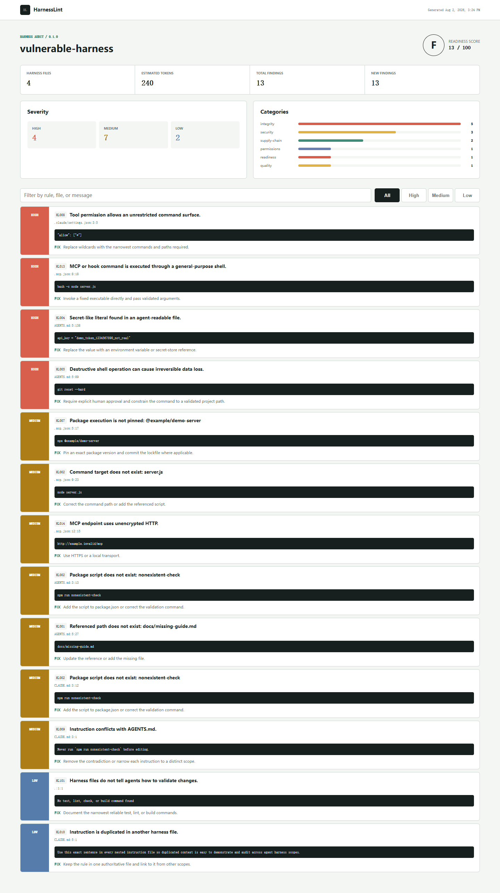

# HarnessLint

Deterministic linting for the files that steer AI coding agents: `AGENTS.md`, `CLAUDE.md`, skills, hooks, Cursor rules, permissions, and MCP configuration.

[](https://github.com/wangzifan396-wzf/small-tools-lab/actions/workflows/ci.yml)
[](https://www.npmjs.com/package/harnesslint)
[](LICENSE)

AI agents inherit powerful instructions from files that rarely receive the same review as application code. HarnessLint finds broken references, unsafe command patterns, broad permissions, floating MCP packages, conflicting guidance, hidden Unicode, and wasted context before an agent acts on them.

- Zero runtime dependencies
- Fully local and deterministic; no model or network call
- Pretty terminal, JSON, SARIF, and self-contained HTML reports
- Stable fingerprints and baselines for gradual adoption
- Git-aware file discovery and cross-platform Node.js 20+ support



## Quick start

Run without installing:

```sh
npx harnesslint@latest .
```

Or add it to a repository:

```sh
npm install --save-dev harnesslint
npx harnesslint . --fail-on high
```

HarnessLint exits with `1` when a new finding meets `--fail-on`, `2` for usage or configuration errors, and `0` otherwise.

## What it catches

```text
HarnessLint
========================================================================
Grade C  Score 70/100  Files 4  Context ~281 tokens
High 2  Medium 1  Low 1

HIGH   HL013 MCP or hook command is executed through a general-purpose shell.
       .mcp.json:9:18
       Fix: Invoke a fixed executable directly and pass validated arguments.
```

| Rule | Severity | Detects |
| --- | --- | --- |
| `HL001` | medium | Referenced files that do not exist |
| `HL002` | medium | Missing package scripts and command targets |
| `HL003` | medium | Oversized agent context files |
| `HL004` | high | Secret-like literals |
| `HL005` | high | Destructive shell instructions |
| `HL006` | high | Potential local-data exfiltration |
| `HL007` | medium | Unpinned `npx` and `uvx` packages |
| `HL008` | high | Wildcard tool permissions |
| `HL009` | medium | Contradictory run/use instructions |
| `HL010` | low | Duplicated instructions across scopes |
| `HL011` | medium | Invalid `SKILL.md` frontmatter |
| `HL012` | high | Hidden and bidirectional Unicode controls |
| `HL013` | high | MCP commands wrapped in a general shell |
| `HL014` | medium | Unencrypted remote MCP endpoints |
| `HL015` | high | Malformed JSON agent configuration |
| `HL100` | low | Missing root agent instructions |
| `HL101` | low | Missing validation guidance |

HarnessLint reports evidence and a suggested repair for every finding. It never runs a command found in a scanned file.

## Reports

```sh
# Machine-readable output
harnesslint . --format json --output harnesslint.json

# GitHub code scanning
harnesslint . --format sarif --output harnesslint.sarif

# Shareable, filterable report with no server required
harnesslint . --format html --output harnesslint-report.html
```

The bundled demo creates an HTML report from an intentionally unsafe harness:

```sh
npm run demo
```

## GitHub Actions

Use the repository as a composite action:

```yaml
permissions:
  contents: read
  security-events: write

steps:
  - uses: actions/checkout@v7
  - uses: wangzifan396-wzf/small-tools-lab/projects/harnesslint@main
    with:
      fail-on: high
      sarif-output: harnesslint.sarif
  - uses: github/codeql-action/upload-sarif@v3
    if: always()
    with:
      sarif_file: harnesslint.sarif
```

## Baselines

Adopt HarnessLint without fixing existing debt in one pull request:

```sh
harnesslint . --write-baseline .harnesslint-baseline.json --fail-on none
harnesslint . --baseline .harnesslint-baseline.json --fail-on medium
```

Baseline matching uses stable 20-character fingerprints derived from rule, path, line, and evidence. Existing findings remain visible but do not fail the check; newly introduced findings do.

## Configuration

Add `.harnesslintrc.json` at the scanned repository root:

```json
{
  "ignore": [
    "fixtures/**",
    "examples/unsafe/**"
  ]
}
```

Patterns are repository-relative, use `/`, and support `*` within a path segment and `**` across segments. A different config can be selected with `--config path/to/config.json`.

## Design boundaries

HarnessLint is a fast static safety net, not a proof that an instruction is correct. Natural-language intent is ambiguous, secret patterns are heuristic, and project-specific permission models vary. Findings are deliberately evidence-first so maintainers can make the final call.

The near-term roadmap includes suppression comments, richer hook schemas, instruction precedence maps, and community rule packs. See [CONTRIBUTING.md](CONTRIBUTING.md) for how to propose a check and [SECURITY.md](SECURITY.md) for private reports.

## License

[MIT](LICENSE)
