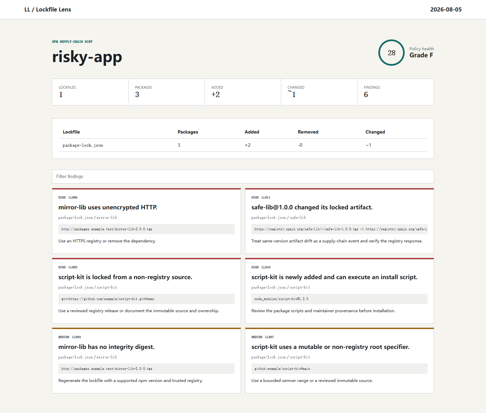

# Lockfile Lens

Explain risky npm lockfile changes before they merge. Lockfile Lens turns opaque `package-lock.json` churn into a deterministic inventory of new packages, source drift, integrity changes, install scripts, registry hosts, and version spread.

[](https://github.com/wangzifan396-wzf/small-tools-lab/actions/workflows/ci.yml)
[](LICENSE)



## Why

Dependency review should answer more than "which top-level version changed?" An npm lockfile can add hundreds of transitive packages, switch registry hosts, introduce lifecycle scripts, or change an integrity digest without changing a version. Lockfile Lens reads the lockfile already committed to the repository and produces evidence that works locally, in pull requests, and in downstream automation.

- npm lockfile v2 and v3 support
- Repository-wide discovery for monorepos
- Git-ref or explicit-file baselines
- 11 source, integrity, execution, complexity, and diff rules
- Terminal, JSON, Markdown, and self-contained HTML output
- Severity gates and a reusable GitHub Action
- No registry calls, installation, telemetry, or package execution

## Quick start

Node.js 20 or newer is required.

```sh
node bin/lockfile-lens.js /path/to/repository
node bin/lockfile-lens.js . --base origin/main
node bin/lockfile-lens.js . --format html --output lockfile-lens-report.html
```

After an npm release, the package can also be run as `npx lockfile-lens`.

## What it reports

| Rule | Severity | Signal |
| --- | --- | --- |
| `LL001` | high | Invalid or unsupported lockfile |
| `LL002` | high | Git, local, or otherwise non-registry source |
| `LL003` | high | Registry host outside the reviewed allowlist |
| `LL004` | medium | Registry artifact without an integrity digest |
| `LL005` | medium | Package marked as having an install script |
| `LL006` | high | Dependency fetched over HTTP |
| `LL007` | medium | Mutable or non-registry root specifier |
| `LL008` | low | One package installed at too many versions |
| `LL009` | medium | Diff adds more packages than the configured budget |
| `LL010` | high | Newly added package can run an install script |
| `LL011` | high | Same version changed source or integrity |

The score is a bounded policy summary, not a vulnerability score. Lockfile Lens does not claim that an install script or alternate registry is malicious; it makes review-relevant trust changes visible.

## Pull request mode

Compare every discovered lockfile with a Git ref:

```sh
node bin/lockfile-lens.js . --base origin/main --fail-on high
```

Compare one discovered lockfile with an explicit file:

```sh
node bin/lockfile-lens.js examples/risky-app \
  --before examples/risky-app/package-lock.before.json \
  --format markdown
```

Exit code `1` means a finding met `--fail-on`, `2` means usage or configuration failed, and `0` means the policy passed.

## GitHub Actions

```yaml
permissions:
  contents: read

steps:
  - uses: actions/checkout@v4
    with:
      fetch-depth: 0
  - uses: wangzifan396-wzf/small-tools-lab/projects/lockfile-lens@main
    with:
      base: ${{ github.event.pull_request.base.sha }}
      fail-on: high
```

## Configuration

Add `.lockfile-lens.json` at the scan root:

```json
{
  "ignore": ["examples/**"],
  "allowedRegistries": ["registry.npmjs.org", "npm.company.example"],
  "maxNewPackages": 40,
  "maxVersionsPerPackage": 3
}
```

Ignore patterns are repository-relative and support `*` within a segment and `**` across segments. Registry hosts are compared case-insensitively.

## Boundaries

Lockfile Lens supports the structured `packages` map in npm lockfile versions 2 and 3. It does not query advisories, infer maintainer trust, verify signatures, parse pnpm/Yarn lockfiles, or execute repository content. Use a vulnerability database and provenance verification alongside this structural review.

## License

[MIT](LICENSE)
