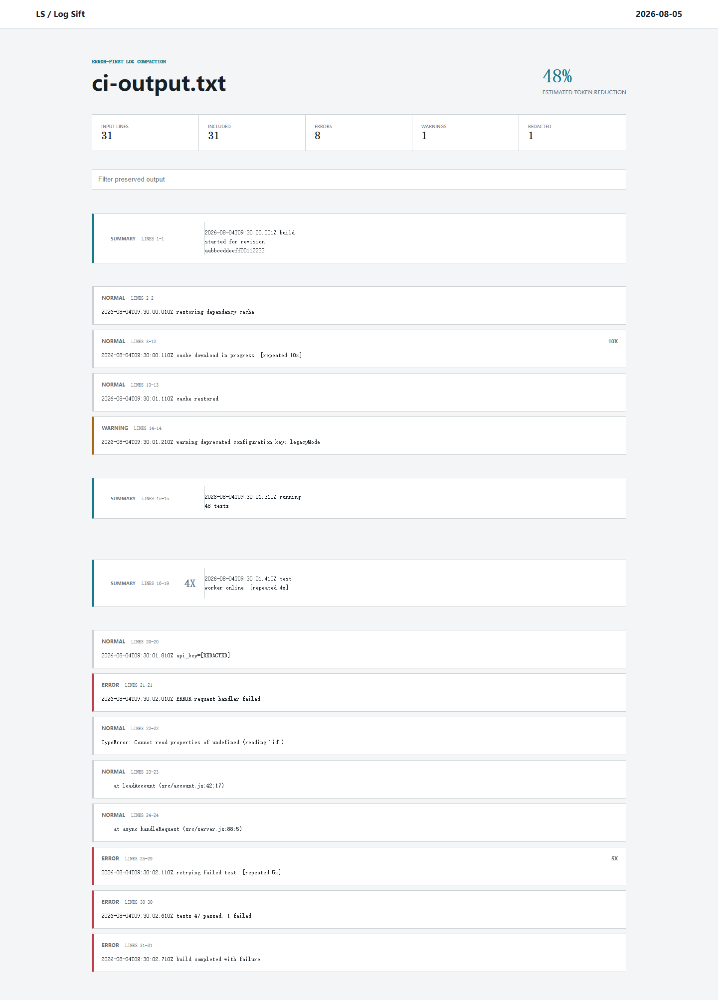

# Log Sift

Turn noisy build and test logs into small, redacted, error-first context for humans and coding agents. Log Sift collapses consecutive repetition, preserves failure neighborhoods, removes ANSI noise, redacts common credential forms, and fits the result into an explicit approximate token budget.

[](https://github.com/wangzifan396-wzf/small-tools-lab/actions/workflows/ci.yml)
[](LICENSE)



## Why

Raw command output is often the largest and least useful part of an agent task. Generic truncation can remove the error, while sending the entire log wastes context and may expose credentials. Log Sift makes a deterministic selection before the text reaches a model or issue report.

- Reads a file or stdin; never runs the command being observed
- Error and warning classification with configurable surrounding context
- Consecutive repetition collapse and omission markers
- ANSI cleanup, optional timestamp removal, and long-line clipping
- Credential, provider-token, bearer-token, and URL-userinfo redaction
- Explicit approximate token budget and compression metrics
- Pretty, JSON, Markdown, and self-contained HTML output
- Optional secret gate for CI
- No model, account, telemetry, or network request

## Quick start

Node.js 20 or newer is required.

```sh
node bin/log-sift.js build.log
node bin/log-sift.js build.log --budget 1200 --format markdown
npm test 2>&1 | node bin/log-sift.js - --budget 800
```

After an npm release, the package can also be run as `npx log-sift`.

## Selection model

Log Sift assigns deterministic priority to grouped lines:

1. Errors and fatal signals
2. Warnings and their configured context
3. Test/build summaries
4. Head and tail context
5. Remaining unique lines

Consecutive lines with the same timestamp-insensitive signature collapse into one representative with a repeat count. Selected groups return to original order, with explicit omission markers between them. If high-priority evidence still exceeds the budget, long lines are clipped and the least important groups are removed first.

Token counts use a stable `characters / 4` estimate. They are a planning measure, not a provider-specific tokenizer result.

## Redaction

The built-in pass recognizes common provider-token prefixes, bearer tokens, secret-like assignments, and credentials embedded in HTTP URLs. It replaces values before budgeting or report generation.

```sh
node bin/log-sift.js build.log --fail-on-secret
```

Exit code `1` means at least one credential-like value was redacted when the gate is enabled. Exit code `2` means input, usage, or configuration failed.

Redaction is intentionally conservative and cannot prove a log is safe to publish. Keep upstream secret masking enabled and review output before sharing it.

## GitHub Actions

Capture command output explicitly, then pass the file to Log Sift:

```yaml
- name: Run tests
  shell: bash
  run: npm test > test-output.txt 2>&1
  continue-on-error: true

- uses: wangzifan396-wzf/small-tools-lab/projects/log-sift@main
  with:
    input: test-output.txt
    budget: 1200
    format: markdown
    output: log-sift.md
    fail-on-secret: true
```

The action deliberately does not execute the test command. This keeps capture, exit-code policy, and log processing separate and reviewable.

## Configuration

Add `.log-sift.json` in the working directory:

```json
{
  "budget": 2000,
  "context": 2,
  "head": 8,
  "tail": 8,
  "maxLineChars": 500,
  "stripTimestamps": false
}
```

CLI `--budget`, `--context`, and `--strip-time` values override the file.

## Boundaries

Log Sift parses plain text. It does not understand every structured logging format, guarantee semantic equivalence, tokenize for a specific model, execute commands, or upload output. JSON logs remain valid input but are treated line by line.

## License

[MIT](LICENSE)
