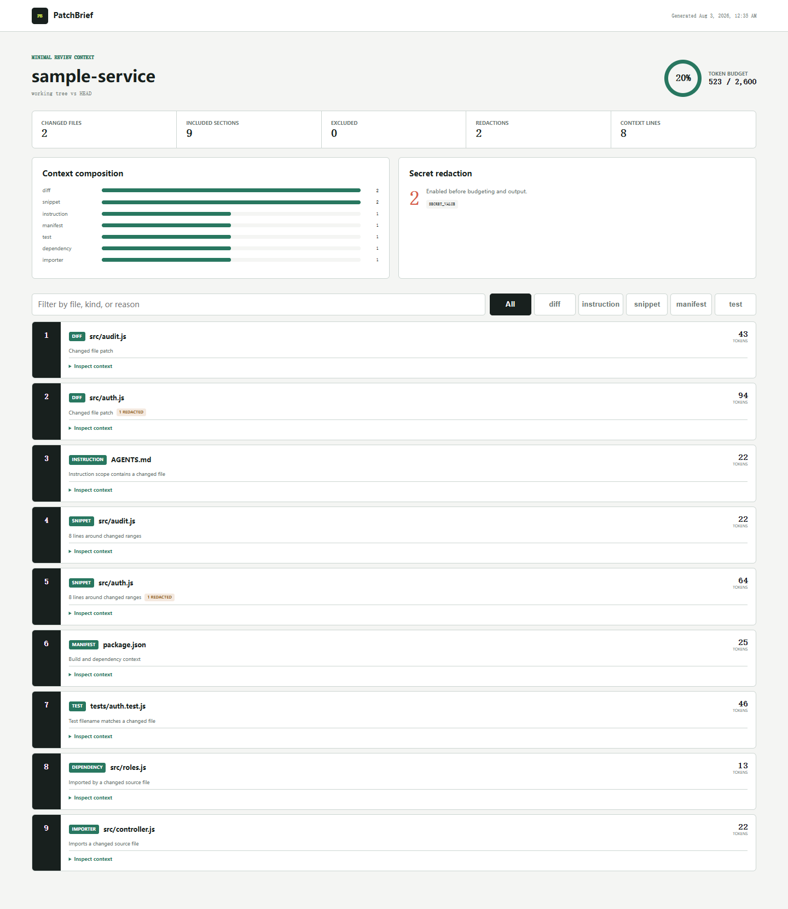

# PatchBrief

Give AI reviewers the change, not the whole repository. PatchBrief builds a minimal, redacted, token-budgeted context packet around a Git diff.

[](https://github.com/wangzifan396-wzf/small-tools-lab/actions/workflows/ci.yml)
[](https://www.npmjs.com/package/patchbrief)
[](LICENSE)

Whole-repository exporters are useful for broad exploration. Code review is narrower: the reviewer needs the patch, applicable instructions, enough changed-file context, related tests, local dependencies, and direct callers. PatchBrief discovers those layers deterministically, redacts common credential forms before budgeting, and records every inclusion and exclusion.

- Working-tree, staged, and pull request merge-base comparisons
- Diff-aware snippets with configurable surrounding lines
- Applicable `AGENTS.md`, `CLAUDE.md`, `GEMINI.md`, and `SKILL.md` discovery
- Related tests, nearest manifests, one-hop local imports, and direct importers
- Fair token allocation across essential changed files
- Default secret redaction and optional CI failure on any redaction
- Terminal, Markdown, XML, JSON, and filterable self-contained HTML output
- Zero runtime dependencies, no source execution, and no network calls



## Quick start

Inspect the current working tree:

```sh
npx patchbrief@latest .
```

Create a review packet from staged changes:

```sh
npx patchbrief . --staged --budget 12000 --format markdown --output patchbrief.md
```

Typical summary:

```text
PatchBrief
========================================================================
sample-service  |  working tree vs HEAD
Budget 523 / 2,600 tokens (20%)  |  2 changed files
Sections 9 included / 0 excluded  |  Redactions 2

Included context
 1. diff          78 tokens  src/auth.js
 2. instruction   22 tokens  AGENTS.md
 3. test           43 tokens  tests/auth.test.js
```

## Why diff-first

| Whole-repository pack | PatchBrief |
| --- | --- |
| Optimized for broad codebase exploration | Optimized for one concrete change |
| Includes most selected files | Starts from changed hunks and expands locally |
| Token use grows with repository size | Token use is bounded by an explicit budget |
| Relevance is mostly path-driven | Relevance includes instructions, tests, imports, and callers |
| Sensitive text may enter the pack | Credential-like values are redacted before selection and output |

PatchBrief does not replace repository explorers. It produces a smaller artifact for review, handoff, debugging, or attaching to an agent task.

## Usage: choose a comparison

```sh
# Tracked and untracked working-tree changes against HEAD
patchbrief .

# Index only
patchbrief . --staged

# Pull request or feature branch from its merge base
patchbrief . --base origin/main --head HEAD
```

The base mode uses Git's three-dot comparison, so changes added independently to the base branch are not attributed to the patch.

## Context priority

PatchBrief ranks candidates in this order:

1. Changed-file diffs
2. Applicable agent instructions
3. Changed-file snippets around each hunk
4. Build and dependency manifests
5. Related tests
6. Configured always-include files
7. One-hop local dependencies
8. Direct importers of changed files

Diffs and applicable instructions are essential. When they exceed the reserved budget, PatchBrief divides tokens fairly across them and truncates the middle of each section. Optional sections use the remaining budget by priority. Every omitted candidate appears in the exclusion manifest with its estimated size and reason.

Token estimates use a transparent four-characters-per-token approximation. Actual tokenizer counts vary by model, so leave headroom when a hard upstream context limit applies.

## Redaction

Redaction is enabled before token estimation and output. Built-in patterns cover common GitHub and API tokens, AWS access keys, private key blocks, and secret-like assignments.

```sh
# Fail CI if the packet needed any redaction
patchbrief . --fail-on-redaction

# Explicitly disable the safety layer
patchbrief . --no-redact
```

`--no-redact` should be used only when the output destination is already trusted. Pattern matching cannot guarantee that every sensitive business value or credential format will be recognized.

## Output formats

```sh
patchbrief . --format summary
patchbrief . --format markdown --output patchbrief.md
patchbrief . --format xml --output patchbrief.xml
patchbrief . --format json --output patchbrief.json
patchbrief . --format html --output patchbrief-report.html
```

Markdown and XML are suitable for model input, JSON for automation, and HTML for inspecting why each context section was selected. Generate the bundled visual demo with `npm run demo`.

## GitHub Actions

```yaml
permissions:
  contents: read

steps:
  - uses: actions/checkout@v7
    with:
      fetch-depth: 0
  - id: context
    uses: wangzifan396-wzf/small-tools-lab/projects/patchbrief@main
    with:
      budget: 12000
      fail-on-redaction: true
  - uses: actions/upload-artifact@v4
    with:
      name: patchbrief
      path: ${{ steps.context.outputs.packet }}
```

The action does not post source context to a public job summary. It returns a local packet path so the workflow controls retention and access.

## Configuration

Add `.patchbrief.json` at the repository root:

```json
{
  "budget": 16000,
  "contextLines": 24,
  "maxFileBytes": 1048576,
  "importerScanLimit": 2000,
  "ignore": [
    "dist/**",
    "fixtures/**"
  ],
  "alwaysInclude": [
    "docs/architecture.md",
    "src/policy/**"
  ]
}
```

Patterns are repository-relative, use `/`, and support `*` inside one segment and `**` across segments. CLI values override budget and context-line configuration.

## Design boundaries

PatchBrief uses filename matching for related tests and static relative-import parsing for JavaScript, TypeScript, Vue, and Python. It does not resolve aliases, dynamic imports assembled at runtime, generated dependency graphs, or semantic relationships. The selection manifest makes these limits visible instead of presenting the packet as complete.

See [CONTRIBUTING.md](CONTRIBUTING.md) for context rule proposals, [SECURITY.md](SECURITY.md) for private reports, and [CHANGELOG.md](CHANGELOG.md) for user-facing changes.

## License

[MIT](LICENSE)
