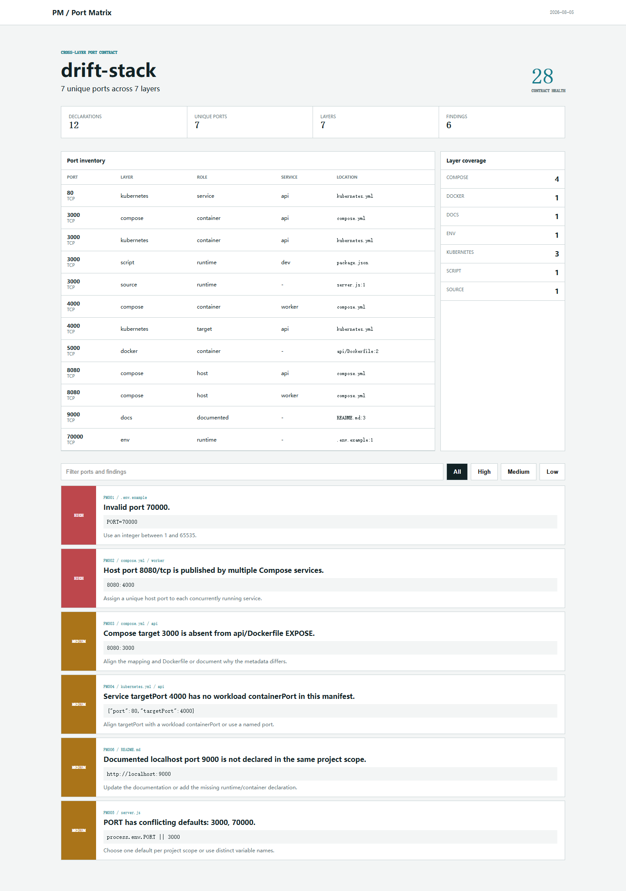

# Port Matrix

Map port declarations across source code, environment examples, package scripts, Dockerfiles, Compose, Kubernetes, and documentation. Port Matrix turns scattered numbers into one reviewable contract and flags collisions, invalid ranges, mismatched container metadata, and stale localhost documentation.

[](https://github.com/wangzifan396-wzf/small-tools-lab/actions/workflows/ci.yml)
[](LICENSE)



## Quick start

Node.js 20 or newer is required.

```sh
node bin/port-matrix.js .
node bin/port-matrix.js . --format markdown --fail-on medium
node bin/port-matrix.js . --format html --output port-matrix-report.html --fail-on none
```

After an npm release, use `npx port-matrix`.

## Supported evidence

- `.env*` variables whose names contain `PORT`
- `package.json` scripts with `--port` or `-p`
- Node, Python, Go, and common config-file listen/default patterns
- Dockerfile `EXPOSE`
- Compose short and long port syntax, parsed as YAML
- Kubernetes workload, Service, target, and node ports, parsed as YAML
- `localhost`, `127.0.0.1`, and `0.0.0.0` URLs in Markdown and text docs

## Rules

| Rule | Severity | Signal |
| --- | --- | --- |
| `PM001` | high | Port is outside 1-65535 |
| `PM002` | high | Multiple Compose services publish the same host port and protocol |
| `PM003` | medium | Compose target differs from the built Dockerfile's `EXPOSE` metadata |
| `PM004` | medium | Kubernetes numeric `targetPort` has no workload `containerPort` in the manifest |
| `PM005` | medium | One port environment variable has conflicting defaults in a project scope |
| `PM006` | medium | Documented localhost port has no declaration in the same project scope |
| `PM007` | low | Host publishes an unapproved privileged port |
| `PM008` | medium | Structured YAML cannot be parsed |

Named Kubernetes ports are retained as a boundary rather than guessed. Docker `EXPOSE` is metadata, not proof that a process listens; mismatches are review prompts rather than runtime claims.

## Configuration

Add `.port-matrix.json` at the scan root:

```json
{
  "ignore": ["fixtures/**", "generated/**"],
  "allowedPrivilegedPorts": [80, 443],
  "allowDocsOnlyPorts": [11434]
}
```

Patterns are repository-relative and support `*`, `?`, and `**`. `allowDocsOnlyPorts` is useful for external local services such as Ollama that documentation may reference but the repository does not own.

## GitHub Actions

```yaml
permissions:
  contents: read

steps:
  - uses: actions/checkout@v7
  - uses: wangzifan396-wzf/small-tools-lab/projects/port-matrix@main
    with:
      fail-on: high
      output: port-matrix.md
```

The action installs the locked YAML parser without lifecycle scripts, analyzes local files, and writes a Markdown job summary.

## Boundaries

Port Matrix is static analysis. It does not bind sockets, execute services, resolve templating systems, infer every framework wrapper, or prove network reachability. Dynamic and named ports should remain documented in deployment-specific validation.

## License

[MIT](LICENSE)
