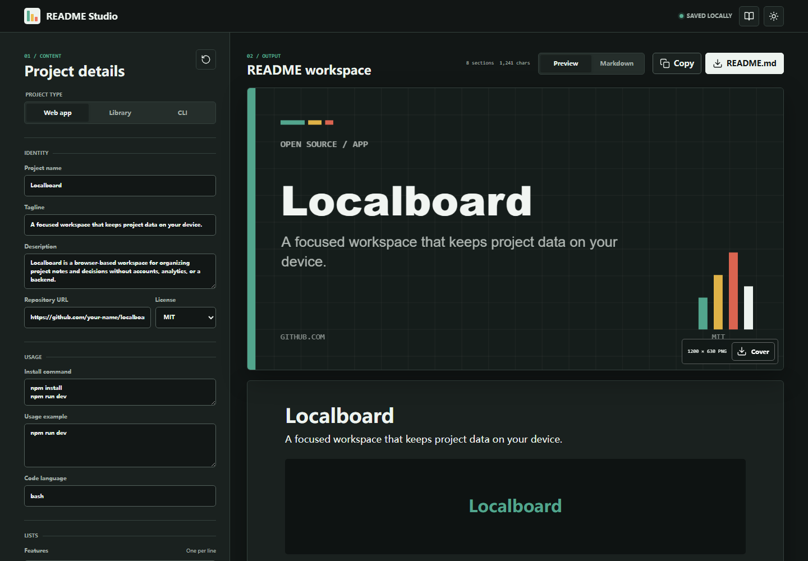

# README Studio

README Studio is a local-first composer for project READMEs and 1200 × 630 social cover images.



[Mobile README preview](docs/readme-studio-mobile.png)

## Features

- Structured templates for web apps, libraries, and command-line tools
- Live README preview without parsing untrusted Markdown into HTML
- Optional cover, badges, table of contents, roadmap, contribution, and license sections
- Downloadable `README.md` and project cover PNG
- Dynamic cover typography, accent presets, and long-name fitting
- Local draft restoration, light and dark themes, and keyboard-accessible view tabs
- No runtime dependencies, backend, account, or analytics

## Run

Open `index.html`, or run:

```bash
npm start
```

Then visit <http://127.0.0.1:4176>.

## Test

```bash
npm test
npm run check
```

No package installation or build step is required. Node.js 20 or newer is recommended for the test scripts.

## Generated assets

The canvas cover is generated entirely in the browser. Download it as `docs/cover.png` when using the default README image path.

## License

[MIT](LICENSE). Interface icons are derived from Lucide under the ISC license; see [THIRD_PARTY_NOTICES.md](THIRD_PARTY_NOTICES.md).
