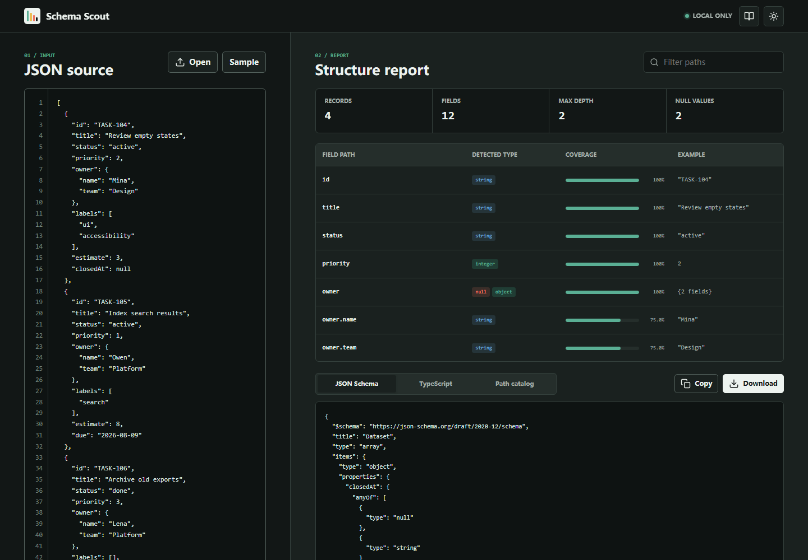

# Schema Scout

Schema Scout profiles JSON data and generates JSON Schema, TypeScript declarations, and a field catalog entirely in the browser.



[Mobile report view](docs/schema-scout-mobile.png)

## Features

- Paste, upload, or drag JSON into a line-numbered editor
- Detect nested paths, mixed types, nulls, depth, and record coverage
- Infer JSON Schema Draft 2020-12 with required and optional fields
- Generate nested TypeScript interfaces and union types
- Filter field paths and inspect representative values
- Export JSON Schema, TypeScript, or CSV without sending source data anywhere
- Responsive light and dark interface with keyboard-accessible output tabs

## Run

Open `index.html` directly, or use the included server:

```bash
npm start
```

Then visit <http://127.0.0.1:4174>.

## Test

```bash
npm test
npm run check
```

No package installation or build step is required. Node.js 20 or newer is recommended for the test scripts.

## Privacy

Input is parsed in memory and is never written to `localStorage` or sent over the network. Only the interface theme is stored locally.

## Limits

Inference describes the supplied sample, not every value a production system may emit. Recursive traversal is capped at 32 levels, and the browser interface limits uploaded files to 10 MB.

## License

[MIT](LICENSE). Interface icons are derived from Lucide under the ISC license; see [THIRD_PARTY_NOTICES.md](THIRD_PARTY_NOTICES.md).
