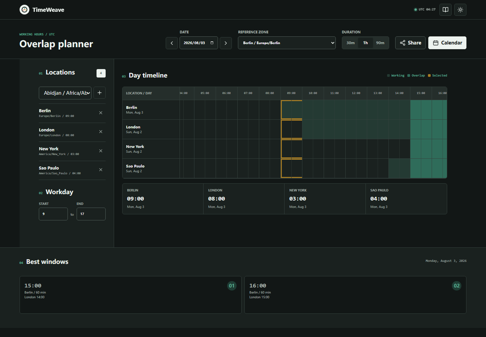

# TimeWeave

TimeWeave is a local-first planner for finding shared working hours across IANA time zones.



[Mobile timeline view](docs/timeweave-mobile.png)

## Features

- Compare 2 to 8 locations on a clickable 30-minute timeline
- Highlight local working hours and shared overlap windows
- Handle daylight-saving changes through the browser's IANA time-zone data
- Change the reference zone without changing the underlying meeting instant
- Tune working hours and 30, 60, or 90 minute durations
- Share plans in the URL and export the selected instant as an `.ics` event
- Store location preferences locally without accounts or analytics
- Responsive light and dark interface

## Run

Open `index.html`, or run:

```bash
npm start
```

Then visit <http://127.0.0.1:4175>.

## Test

```bash
npm test
npm run check
```

The tests cover standard offsets, daylight-saving offsets, weekend exclusion, overlap detection, date arithmetic, and calendar output. Node.js 20 or newer is recommended.

## Time-zone behavior

The app stores meeting choices as UTC instants and formats them in each selected IANA zone. `Intl.DateTimeFormat` provides the host browser's time-zone rules. Results therefore depend on the time-zone database bundled with the browser or Node.js runtime.

## License

[MIT](LICENSE). Interface icons are derived from Lucide under the ISC license; see [THIRD_PARTY_NOTICES.md](THIRD_PARTY_NOTICES.md).
